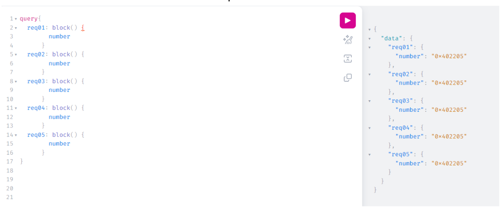

# CVE-2023-42319 : Geth Denial Of Service through the GraphQL endpoint

## Introduction

[go-ethereum](https://geth.ethereum.org/) (Geth) is the most deployed Execution Layer for Ethereum.

GraphQL is a query language for APIs, commonly seen in Web2 applications querying the blockchain.

**Geth **proposes a GraphQL endpoint that can be activated by adding the option **--http --graphql** at start of the service.

However, this component is buggy and subject to Denial Of Service because:

* It consumes a lot of resources
* It is possible to perform unlimited GraphQL requests within a single HTTP request

The present research was conducted in July 2023, with the issue being sent to Geth team on July 4th 2023.

## GraphQL batch of requests with aliases

When GraphQL endpoint is activated, a new path is available on the RPC server showing a GraphQL interface: **http://[@IP]:8545/graphql/ui**

Here is an example of a GraphQL query sent from the interface, to retrieve the current block number:

The format of the GraphQL query is :

Behind the scenes, when a GraphQL request is performed, the GraphQL request is encapsulated within a HTTP request :

The concept of GraphQL aliases is to put multiple GraphQL queries within a simple HTTP request, like in the picture below:

In terms of GraphQL syntax, it looks like this:

The result of such a request is that the server will **treat each GraphQL query individually**, and return them within the same HTTP response.

This means that someone can ask the server to perform hundreds, even thousands of GraphQL operations, **within a single HTTP request**, which can lead to resource exhaustion, therefore causing a **Denial Of Service**.

## Exploitation

When the GraphQL service is enabled on Geth, it is possible to retrieve all the possible requests and arguments of GraphQL by performing the **introspection query**:

This request returns a large JSON, that can be uploaded on a website like [GraphQL Voyager](https://graphql-kit.com/graphql-voyager/), or simply put in the **InQL Scanner** module for analysis:

Note: since Geth is public, it is also possible to retrieve this information from the source [code](https://github.com/ethereum/go-ethereum/blob/master/graphql/schema.go).

By analyzing the results, the **logs.query** from **Geth** is interesting because the filter **fromBlock **means that the server would have to recompute, for each GraphQL query, all the logs from the mentioned block. This **seems expensive in terms of resources**. Using aliases for this query would look like this :

The following python script can be used to generate a payload:

This will generate a payload.json file that can be sent through the GraphQLinterface : 

The tests were performed on a Sepolia full node, with 16Gb of RAM memory. 

The node was synced, Consensus client was prysm. Nothing else was running on the server. Geth version used is the latest stable at the time : **1.12.2-stable-bed84606**.

The [first video](https://drive.google.com/file/d/12CnXF2nHxF9j6IuiaeZUMIJw_EcoKuXy/view?usp=sharing) shows that the node is living his life peacefully and is using 1.1Gb of RAM memory.

Then, at 00:10 the following GraphQL request was sent:

This single HTTP request is performing **only 2 GraphQL requests **with aliases.

When the request is fired, you can see:
1. At 00:40, the RAM memory went up to 9,4Gb of RAM (+8.3Gb for 2 GraphQL requests)
2. At the same time, request timeout on Web browser after 30 seconds (00:10 + 30 seconds) 
3. However, memory went up to 10.6Gb and did not decrease for at least the remaining two minutes (sometimes, it decreases back to normal after 60 seconds but behavior is inconsistent).

With a simple request with 2 aliases, the Geth server is suffering.

Then to crash the node entirely, you can just add more queries (10 aliases), as shown in the [following video](https://drive.google.com/file/d/1dvgGe13yYQv1Ut34plof1b3OAeaD91gi/view?usp=sharing) where the node gets unresponsive after it reaches its RAM maximum (12.4Gb after 00:35).

## Vulnerable servers in the wild

By using Shodan, looking for Geth servers having port 8445 port opened, it is possible to find a bit more than 8000 servers with Geth exposed. Among those, over 80 had the vulnerable GraphQL endpoint exposed.

The script below was used to identify vulnerable servers among the 8000 ones:

This is not a big number, but those servers might have a validator running using those vulnerable instances. Putting Geth down would cause the stakers financial harm since they could not validate attestations (they would even get [penalties](https://ethereum.org/fr/developers/docs/consensus-mechanisms/pos/rewards-and-penalties/#penalties)) and they could not participate in block proposals.

## Ethereum response

Geth team was very reactive and professional.

Because the GraphQL feature is an option, it is out of scope of the Ethereum Bug Bounty program. More surprisingly, the team has no intention of fixing the issue.

This seems to be tied to the fact that they consider that [RPC port should be blocked in terms of Firewalling](https://geth.ethereum.org/docs/fundamentals/security).

This however does not eliminate the issue and it is not difficult to find and exploit vulnerable servers in the wild.

After discussing with the team, they have decided to update the Security page of Geth to warn users about exposing the GraphQL endpoint :

Since September 5th, the Geth [webpage](https://geth.ethereum.org/docs/fundamentals/security) was updated.A special part regarding API Security was added, mentioning GraphQL :

